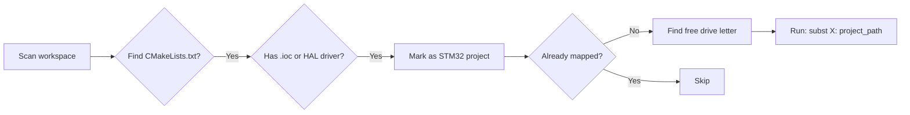

# stm32-cmake-subst

[English](README.md) | [简体中文](README_zh.md)

A PowerShell script that solves Windows path compatibility issues in **STM32CubeMX + CMake + VSCode** workflows caused by non-ASCII characters (e.g., Chinese usernames in `C:\Users\张三\`).

---

## Table of Contents

- [Background](#background)
- [Quick Start](#quick-start)
- [Usage](#usage)
  - [`setup` — Create Mappings](#setup--create-mappings)
  - [`list` — List Mappings](#list--list-mappings)
  - [`remove` — Remove Mappings](#remove--remove-mappings)
- [How It Works](#how-it-works)
- [Project Structure](#project-structure)
- [Configuration](#configuration)
- [FAQ](#faq)
- [Compatibility](#compatibility)
- [Related Resources](#related-resources)
- [License](#license)

---

## Background

**The Problem**

STM32CubeMX generates code with hard-coded absolute paths in `.cproject`, `.mxproject`, and CMake build files. When your Windows username or project path contains non-ASCII characters (Chinese, Japanese, Cyrillic, etc.), toolchains like **ARM GCC** and **CMake** may fail with cryptic encoding errors — especially when Ninja is used as the build backend.

**The Solution**

Use Windows' built-in `subst` command to map your project folder to a pure-ASCII virtual drive letter (e.g., `T:\`). The script automates discovery, mapping, and cleanup — no manual `subst` commands needed.

---

## Quick Start

```powershell
# 1. Place the script at the root of your STM32 workspace
# 2. Run setup
.\setup_stm32_subst.ps1 setup
```

The script will:
1. Scan subdirectories for STM32 CMake projects (detected via `.ioc` files or HAL drivers)
2. Display found projects and their mapping status
3. Assign available drive letters (starting from `T:`) to unmapped projects
4. Print a summary of all current `subst` mappings

After that, open your project via the virtual drive (e.g., `T:\flashing_light\`) and build with CMake as usual.

---

## Usage

> **TL;DR:** Copy `setup_stm32_subst.ps1` to your workspace root, then run `.\setup_stm32_subst.ps1 setup`.

### `setup` — Create Mappings

```powershell
.\setup_stm32_subst.ps1 setup
```

Scans the workspace, discovers STM32 CMake projects, and maps unmapped projects to free drive letters.

**Sample output:**

```
============================================
  STM32 CMake 项目 Subst 映射工具
============================================

[*] 扫描目录: C:\Users\张三\STM32_Projects
[*] 正在查找 STM32 CMake 项目...

[*] 找到 2 个项目:

  flashing_light     [未映射]
    路径: C:\Users\张三\STM32_Projects\flashing_light
  temps_sensor       [未映射]
    路径: C:\Users\张三\STM32_Projects\temps_sensor

[+] 映射 flashing_light -> T:
    成功: T: => C:\Users\张三\STM32_Projects\flashing_light

[+] 映射 temps_sensor -> U:
    成功: U: => C:\Users\张三\STM32_Projects\temps_sensor

============================================
  当前所有映射状态:
============================================
  T:\: => C:\Users\张三\STM32_Projects\flashing_light
  U:\: => C:\Users\张三\STM32_Projects\temps_sensor
```

> **⚠️ Note:** `subst` mappings are **not persistent across reboots**. Re-run the script after restarting, or add it to your startup tasks.

---

### `list` — List Mappings

```powershell
.\setup_stm32_subst.ps1 list
```

Displays all current `subst` mappings relevant to the workspace without making changes.

---

### `remove` — Remove Mappings

```powershell
.\setup_stm32_subst.ps1 remove
```

Removes `subst` mappings that belong to projects under the current workspace. Safe — only removes mappings the script created.

---

## How It Works



**Project detection logic:**
- Recursively searches for `CMakeLists.txt` in subdirectories (depth: 3 levels by default)
- Validates as a STM32 project by checking for `.ioc` CubeMX files or `STM32*xx_HAL_Driver` directories
- Deduplicates existing `subst` mappings to avoid collisions

**Drive letter allocation:**
- Starts from `T:` (configurable) and searches upward to `Z:`
- Skips already-used drive letters (A:–D: are system-reserved in practice)

---

## Project Structure

Place `setup_stm32_subst.ps1` at the **workspace root**, alongside your STM32 project folders:

```
STM32_Workspace\
├── setup_stm32_subst.ps1        ←  Put the script here
├── flashing_light\
│   ├── flashing_light.ioc
│   ├── CMakeLists.txt
│   ├── CMakePresets.json
│   ├── Core\
│   │   ├── Inc\
│   │   └── Src\
│   └── Drivers\
├── temps_sensor\
│   ├── temps_sensor.ioc
│   ├── CMakeLists.txt
│   └── ...
└── lib\                          ←  Shared libraries (ignored if no .ioc)
    └── ...
```

The script only maps directories that contain both `CMakeLists.txt` and a STM32 project marker (`.ioc` or HAL driver).

---

## Configuration

Edit the following variables at the top of `setup_stm32_subst.ps1`:

| Variable | Default | Description |
|----------|---------|-------------|
| `$StartDriveChar` | `'T'` | First drive letter to try for mapping (A:–D: are skipped) |
| `$ScanDepth` | `3` | Max directory depth for scanning `CMakeLists.txt` |

Example — starting from `X:` instead:

```powershell
$StartDriveChar = 'X'
```

---

## FAQ

**Q: Mappings disappear after restart — why?**

`subst` is session-only by design. Re-run `.\setup_stm32_subst.ps1 setup` after reboot, or create a scheduled task to run it at logon.

**Q: "Access Denied" or the script won't run?**

Run PowerShell as **Administrator**. Some environments require elevated privileges for `subst`.

**Q: How do I make mappings permanent?**

Create a Windows scheduled task triggered at user logon:
```powershell
$action = New-ScheduledTaskAction -Execute "powershell.exe" -Argument "-File `"C:\path\to\setup_stm32_subst.ps1`" setup"
$trigger = New-ScheduledTaskTrigger -AtLogon
Register-ScheduledTask -TaskName "STM32 Subst Mapping" -Action $action -Trigger $trigger
```

**Q: Can I use this for non-STM32 CMake projects?**

The script specifically detects STM32 projects. You can modify the detection logic in `Find-STM32CMakeProjects` to match your project type.

**Q: Does it work with STM32CubeIDE?**

Yes — if you use CubeIDE's generated CMake output or import the project into VSCode with CMake, the same `subst` mapping applies.

---

## Compatibility

| Item | Status |
|------|--------|
| **Windows** | Windows 10 / 11 |
| **PowerShell** | 5.1 (built-in) and 7.x |
| **STM32 MCU** | Tested on STM32F103C8T6 — should work with all STM32 series |
| **CMake** | 3.20+ |
| **Toolchain** | ARM GCC (`gcc-arm-none-eabi`) |

> **Issues welcome!** Only tested on STM32F103C8T6 so far — report problems with other chips via [GitHub Issues](https://github.com/deepseek-ai/awesome-deepseek-agent/issues).

---

## Related Resources

- [STM32CubeMX](https://www.st.com/en/development-tools/stm32cubemx.html) — ST's official code generator
- [CMake Presets](https://cmake.org/cmake/help/latest/manual/cmake-presets.7.html) — Recommended way to configure CMake in VSCode
- [Windows `subst` command](https://learn.microsoft.com/en-us/windows-server/administration/windows-commands/subst) — Microsoft Docs
- [ARM GNU Toolchain](https://developer.arm.com/Tools%20and%20Software/GNU%20Toolchain) — ARM GCC downloads

---

## License

This project is licensed under the terms of the [LICENSE](LICENSE) file.
