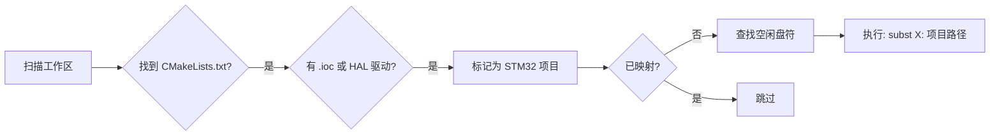

# stm32-cmake-subst

[English](README.md) | [简体中文](README_zh.md)

解决 **STM32CubeMX + CMake + VSCode** 工作流在 Windows 下因非 ASCII 字符（如中文用户名 `C:\Users\张三\`）导致的路径兼容性问题的 PowerShell 脚本。

---

## 目录

- [背景](#背景)
- [快速开始](#快速开始)
- [用法](#用法)
  - [`setup` — 创建映射](#setup--创建映射)
  - [`list` — 查看映射](#list--查看映射)
  - [`remove` — 删除映射](#remove--删除映射)
- [工作原理](#工作原理)
- [项目结构](#项目结构)
- [配置](#配置)
- [常见问题](#常见问题)
- [兼容性](#兼容性)
- [相关资源](#相关资源)
- [许可证](#许可证)

---

## 背景

**痛点**

STM32CubeMX 生成的代码会在 `.cproject`、`.mxproject` 以及 CMake 构建文件中写入绝对路径。当 Windows 用户名或项目路径包含中文字符时，**ARM GCC** 和 **CMake**（尤其是配合 Ninja 使用时）容易因编码问题而构建失败。

**解决方案**

利用 Windows 自带的 `subst` 命令，将项目文件夹映射为一个纯 ASCII 的虚拟盘符（如 `T:\`）。脚本负责自动发现项目、分配盘符、创建和清理映射——无需手敲 `subst` 命令。

---

## 快速开始

```powershell
# 1. 将脚本放在 STM32 工作区的根目录
# 2. 运行 setup
.\setup_stm32_subst.ps1 setup
```

脚本会：
1. 扫描子目录，自动发现 STM32 CMake 项目（通过 `.ioc` 文件或 HAL 驱动识别）
2. 列出找到的项目及其映射状态
3. 为未映射的项目分配可用盘符（默认从 `T:` 开始）
4. 打印当前所有 `subst` 映射摘要

之后通过虚拟盘符打开项目（如 `T:\flashing_light\`），即可正常使用 CMake 构建。

---

## 用法

> **简单来说：** 把 `setup_stm32_subst.ps1` 复制到工作区根目录，然后运行 `.\setup_stm32_subst.ps1 setup`。

### `setup` — 创建映射

```powershell
.\setup_stm32_subst.ps1 setup
```

扫描工作区、发现 STM32 CMake 项目、为未映射的项目分配空闲盘符。

**示例输出：**

```
============================================
  STM32 CMake 项目 Subst 映射工具
============================================

[*] 扫描目录: C:\Users\张三\STM32_Projects
[*] 正在查找 STM32 CMake 项目...

[*] 找到 2 个项目:

  flashing_light     [未映射]
    路径: C:\Users\张三\STM32_Projects\flashing_light
  temps_sensor       [未映射]
    路径: C:\Users\张三\STM32_Projects\temps_sensor

[+] 映射 flashing_light -> T:
    成功: T: => C:\Users\张三\STM32_Projects\flashing_light

[+] 映射 temps_sensor -> U:
    成功: U: => C:\Users\张三\STM32_Projects\temps_sensor

============================================
  当前所有映射状态:
============================================
  T:\: => C:\Users\张三\STM32_Projects\flashing_light
  U:\: => C:\Users\张三\STM32_Projects\temps_sensor
```

> **⚠️ 注意：** `subst` 映射**重启后会自动消失**。重启后请重新运行脚本，或将其添加到开机自启任务中。

---

### `list` — 查看映射

```powershell
.\setup_stm32_subst.ps1 list
```

仅显示当前工作区相关的 `subst` 映射，不做任何修改。

---

### `remove` — 删除映射

```powershell
.\setup_stm32_subst.ps1 remove
```

删除当前工作区下项目所对应的 `subst` 映射。安全操作——只会删除本脚本创建的映射。

---

## 工作原理



**项目发现逻辑：**
- 递归搜索子目录中的 `CMakeLists.txt`（默认深度 3 层）
- 通过检查 `.ioc` 文件或 `STM32*xx_HAL_Driver` 目录来确认是 STM32 项目
- 自动去重已有的 `subst` 映射，避免冲突

**盘符分配策略：**
- 从 `T:` 开始（可配置），向上搜索到 `Z:`
- 跳过已被占用的盘符（A:–D: 通常为系统保留）

---

## 项目结构

将 `setup_stm32_subst.ps1` 放在**工作区根目录**，与 STM32 项目文件夹并列：

```
STM32_Workspace\
├── setup_stm32_subst.ps1        ←  脚本放这里
├── flashing_light\
│   ├── flashing_light.ioc
│   ├── CMakeLists.txt
│   ├── CMakePresets.json
│   ├── Core\
│   │   ├── Inc\
│   │   └── Src\
│   └── Drivers\
├── temps_sensor\
│   ├── temps_sensor.ioc
│   ├── CMakeLists.txt
│   └── ...
└── lib\                          ←  公共库（无 .ioc 则忽略）
    └── ...
```

脚本只会映射同时包含 `CMakeLists.txt` 和 STM32 项目标识（`.ioc` 或 HAL 驱动）的目录。

---

## 配置

编辑 `setup_stm32_subst.ps1` 顶部的以下变量：

| 变量 | 默认值 | 说明 |
|------|--------|------|
| `$StartDriveChar` | `'T'` | 映射起始盘符（A:–D: 已被跳过） |
| `$ScanDepth` | `3` | 扫描 `CMakeLists.txt` 的最大目录深度 |

示例——改为从 `X:` 开始分配：

```powershell
$StartDriveChar = 'X'
```

---

## 常见问题

**Q: 重启后映射消失了？**

`subst` 是会话级别的，重启后自动清除。重启后重新运行 `.\setup_stm32_subst.ps1 setup`，或者创建一个 Windows 计划任务在登录时自动运行。

**Q: 脚本报 "Access Denied" 或无法运行？**

请以**管理员身份**运行 PowerShell。部分环境下 `subst` 需要管理员权限。

**Q: 如何让映射永久生效？**

创建一个登录时触发的 Windows 计划任务：
```powershell
$action = New-ScheduledTaskAction -Execute "powershell.exe" -Argument "-File `"C:\path\to\setup_stm32_subst.ps1`" setup"
$trigger = New-ScheduledTaskTrigger -AtLogon
Register-ScheduledTask -TaskName "STM32 Subst Mapping" -Action $action -Trigger $trigger
```

**Q: 能用于非 STM32 的 CMake 项目吗？**

脚本专门检测 STM32 项目特征。如需用于其他项目类型，请修改 `Find-STM32CMakeProjects` 函数中的检测逻辑。

**Q: 能和 STM32CubeIDE 一起用吗？**

可以——如果你使用 CubeIDE 生成的 CMake 输出或将项目导入 VSCode 配合 CMake 使用，同样的 `subst` 映射也适用。只需在虚拟盘符下打开项目即可。

**Q: 盘符冲突了怎么办？**

脚本会自动跳过已占用的盘符。如果从 T: 到 Z: 全部被占用，脚本会报错提示。你可以手动清理不必要的盘符映射或调整 `$StartDriveChar`。

---

## 兼容性

| 项目 | 状态 |
|------|------|
| **Windows** | Windows 10 / 11 |
| **PowerShell** | 5.1（系统内置）及 7.x |
| **STM32 芯片** | 已在 STM32F103C8T6 上测试 —— 理论支持全系列 |
| **CMake** | 3.20+ |
| **工具链** | ARM GCC（`gcc-arm-none-eabi`） |

> **欢迎提 Issue！** 目前仅在 STM32F103C8T6 上验证过，如遇到其他芯片的问题欢迎反馈。

---

## 相关资源

- [STM32CubeMX](https://www.st.com/zh/development-tools/stm32cubemx.html) — ST 官方代码生成工具
- [CMake Presets](https://cmake.org/cmake/help/latest/manual/cmake-presets.7.html) — VSCode 中推荐使用的 CMake 配置方式
- [Windows `subst` 命令](https://learn.microsoft.com/zh-cn/windows-server/administration/windows-commands/subst) — Microsoft 官方文档
- [ARM GNU 工具链](https://developer.arm.com/Tools%20and%20Software/GNU%20Toolchain) — ARM GCC 下载

---

## 许可证

本项目使用 [LICENSE](LICENSE) 文件中规定的许可条款。